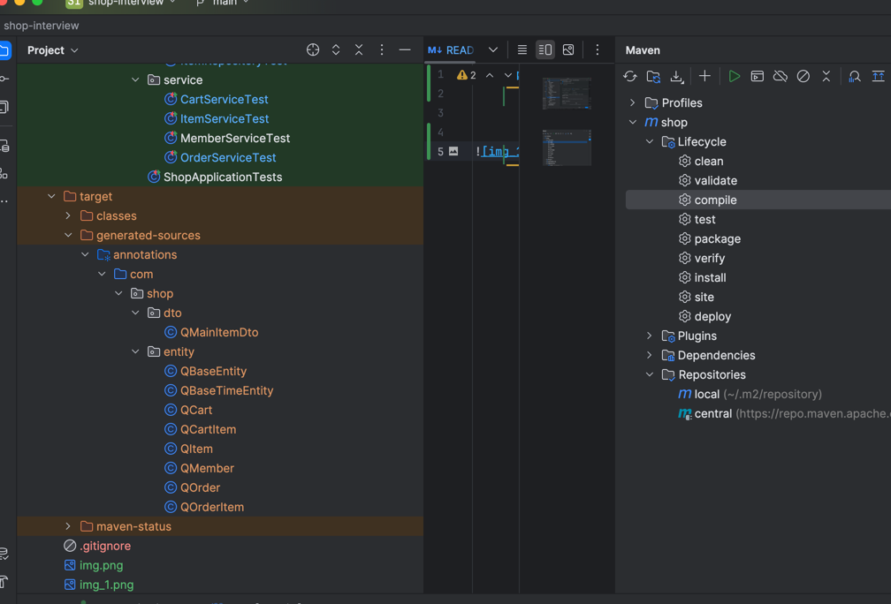

**Simple Shopping application**


- Requirements
  - java 17 
  - MySQL

- application.properties
  - There is two properties, one for running service, and the other for testing.
  - To run server need to setup connection string, username, and password in application.properties file
  
  ```
  #MySQL

    spring.datasource.driver-class-name=com.mysql.cj.jdbc.Driver

    spring.datasource.url=jdbc:mysql://HOST:3306/DATABASE?serverTimezone=UTC

    spring.datasource.username=****

    spring.datasource.password=****
  ```
  
- It is recommended to run application with Intellij
  - To use lombok, need to activate 'enable annotation processing' option in Setting 


- If there is problem with Q*** Entity which is generated by QueryDSL, need to perfom **mvn:clean** and re-run.
- 

- Check if there is generated files under /target/generated-sources/....




- If there is problem with dependency(like cannot find file Q****), need to include generated files into source.


- if there is error like below...
- Class com.sun.tools.javac.tree.JCTree$JCImport does not have member field 'com.sun.tools.javac.tree.JCTree qualid'
- You need to setup Project SDK with version 17 (this is not compatible with JDK 21)
  